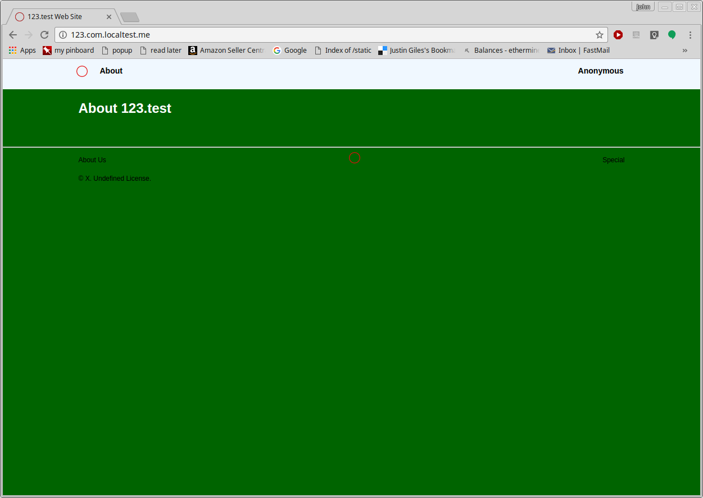

# Fondum

The **F**lask **O**Auth **N**GINX **D**ocker **U**nicorn **M**ongoDB super-framework.

*FONDUM* is a useful tool to generate web site projects.

It uses Flask, which is a tiny simple microframework. Then a large number of libraries and presumptive and complex requirements are added. In other words, it's not tiny anymore. The dictator of the fondum project pre-emptively decides what should be added. Such arrogance!

The following are the goals:

* Make it easy to _quickly_ create a functioning web site.
* Preemptively add a lot of functions that are not usually considered until *much* later as a project expands. The important bit is that these extra functions CAN BE SAFELY IGNORED until you are ready to use them. Such as:
   * External authentication
   * Multilingual translation and localization
   * Logging and Error Handling with integrated Flash messaging
   * Scalable image storage
   * Cloud distribution
      * instances that handle multiple hosts, or
      * a single host spread across multiple instances
   * Repository storage
   * Monitization from tips, advertisements, or direct payment
   * Usage tracking and A/B testing
* Splits implementation roles between IT/Ops and Developer.
   * IT/Ops folks do things that are complicated obscurely technical. Changes are made from a command-line shell. For example, generating the project's files, maintaining the URL routes, distributing docker containers, etc.
   * Developers do things with creative eye and skill. Changes are made from the live web. For example, writing content and uploading pictures.
* Performance Goals:
   * Emphasize _run-time_ performance over _compile-time_ performance. It is better to waste the programmer's time once than the public's time repeatedly. To wit:
      * Render and test as much as possible during compilation. (But not so much as to cause problem with the Developer.)
   * Emphasize _client_ performance more than _server_ performance. Expect more of your server's capabilities, which you control, more than the end-users capabilities, which you can't control.
      * Have the web site create tightly generated HTML5/CSS that requires little of the end-users browser and network connection.
* Refrain from adding duplicative features.
   * Fondum should _not_ appeal to all people and use cases. (But if you want to add some extra bling, feel free to fork this project. It is open source after all.)
   * The include/exclude decision of the benevelant dictator is subjective and somewhat arbitrary.
   * For example, Fondum chooses to store images on Amazon S3. There are lots of many **good** alternatives to S3. But only one is chosen.

## Preparing To Use Fondum

1. If not already installed, install Python 2.7+ and Python 3.5+. Details vary by OS. If not automatically installed with Python 3, you will also need to install pip3. (Fondum uses Python 3, Flask runs under Python 2.7)
2. If not already installed, install [GIT](https://git-scm.com/). 
3. If not already installed, install Fondum itself system-wide.

   ```
   me@machine ~ $ sudo pip3 install fondum
   ```

   Alternatively, install from the repo directly:

   ```
   me@machine ~ $ sudo pip3 install git+https://github.com/JohnAD/fondum.git#egg=fondum
   ```


4. If not already installed, install [docker](https://www.docker.com/). Details vary by OS.
5. If not already installed, install [docker-compose](https://docs.docker.com/compose/). Details vary by OS.
6. Change to the directory where you store your web projects. (Or, make such a directory.)

   ```
   me@machine ~ $ cd WebSites
   me@machine ~/WebSites $
   ```

7. Establish fondum control in that directory:

   ```
   me@machine ~/WebSites $ fondum establish
   ESTABLISH fondum root directory at /home/me/WebSites.
     01 looking for python 3.5 or better.
       > python 3.5 found.
     02 looking for GIT.
       > git found.
     03 looking for docker and docker-compose.
       > docker found.
       > docker-compose found.
   Done.
   ```

You are now ready to start a Fondum project.


## Starting a Project with Fondum

1. Change to the directory where you store your web projects.
2. Invoke fondum to create your project using the domain name of your web site. This will create a "dummy" website that is fully functional. It will also create the hosting docker directory, which is "docker_default" by default.

   ```
   me@machine ~/WebSites $ python3 fondum/create.py 123.test
   ```

3. Enter the newly created docker directory and build the docker containers.

   ```
   me@machine ~/WebSites $ cd docker_default
   me@machine ~/WebSites/docker_default $ sudo docker-compose build
   db uses an image, skipping
   Building fondum_123.test
   Step 1/5 : FROM python:2.7
   2.7: Pulling from library/python
   85b1f47fba49: Pull complete
   ba6bd283713a: Pull complete
   817c8cd48a09: Pull complete
   ```
   (_much removed_)
   ```
   Status: Downloaded newer image for tutum/nginx:latest
    ---> a2e9b71ed366
   Step 2/3 : RUN rm /etc/nginx/sites-enabled/default
    ---> Running in f596493df554
    ---> 72feceef431a
   Removing intermediate container f596493df554
   Step 3/3 : COPY sites-enabled/ /etc/nginx/sites-enabled
    ---> cb7e5a371277
   Removing intermediate container 7ea909cb7663
   Successfully built cb7e5a371277
   Successfully tagged dockerdefault_nginx:latest
   ```

4. Start the docker containers.

   ```
   me@machine ~/WebSites/docker_default $ sudo docker-compose up
   ```
   (_much removed_)
   ```
   fondum_123.test_1  | DEVELOPMENT mode instance.
   fondum_123.test_1  |  * Running on http://0.0.0.0:8000/ (Press CTRL+C to quit)
   fondum_123.test_1  |  * Restarting with stat
   db_1               | 2017-11-28T18:32:30.307+0000 I NETWORK  [initandlisten] connection accepted from 172.19.0.3:48218 #2 (2 connections now open)
   fondum_123.test_1  |  * Debugger is active!
   fondum_123.test_1  |  * Debugger PIN: 731-458-506   
   ```

5. Test the new website! From the same computer, browse to the localtest.me version. For example, `http://123.test.localtest.me/`

   

   The `*.localhost.me` domain always resolves to your local computer at `127.0.0.1`.

6. When done testing, press `Ctrl+C` to stop docker.

   ```
   ^CGracefully stopping... (press Ctrl+C again to force)
   Stopping dockerdefault_nginx_1           ... done
   Stopping dockerdefault_fondum_123.test_1 ... done
   Stopping dockerdefault_db_1              ... done
   me@machine ~/WebSites/docker_default $ 
   ```

## Making Changes

1. Edit the files in `settings` and `custom` subdirectories in the website directory to make the site the way you want.
2. Re-compile the site with fondum from the project root directory.

   ```
   me@machine ~/WebSites/123.test $ cd ..
   me@machine ~/WebSites $ fondum compile 123.test
   COMPILE project 123.test.
   COMPOSE docker group(s) associated with 123.test.
   ['123.test']
   ```

3. Go back step 1 until you are happy with the results.
4. Deploy the docker containers on your favorite cloud hosting service.

## List of Functions Beyond Flask

* **Docker**: a service that efficiently stores the project in "virtual machines". Used for both testing and deployment.
* **MongoDB**: a NoSQL database. Accessed via the MongoEngine library.
* **Google OAuth2**: an open authentication method. Allows users to login and create account with their Google accounts.
* **Amazon S3**: an object (file) storage service. It is where we keep most of the images.
* **NGINX**: the web server that serves the web pages to the public.
* **Unicorn**: a wrapper for flask used by NGINX in production environments.
* **Creole**: the `python-creole` library interprets the [creole](http://www.wikicreole.org/) text format. Used for safely formatting the live web content.
* **Stripe**: Electronic payment processor.
* **FLATTR**: Online patronage tips for web pages and other content.
* **localtest.me**: support for wildcard localhost domains for development testing.
* **SendGrid**: an outbound SMTP Email service.

## Documenation Support Assumptions

The following is a list of artibrary assumptions about the context fondum will be used in. They are not part of the framework itself, but all testing is done against these assumptions. And, documentation is filmed/written with the assumptions.

* **Digital Ocean**: the hosting service for hosting the web and mongodb service.
* **NameCheap.com**: Domain name purchase and management.

TBD:

* Babel/BabelFish: a library that handles multi-lingual internationalization. Creates and uses PO/POT translation files.
* some kind of traffic tracking
* compile-time compression of HTML5/CSS.

## Built-In Libraries

* Msg: a service that generically returns "responses". Used specifically for: 
    * generates logs (handler sends them to MongoDB collection)
    * web flash messages
    * python function responses
* Page: a page description class that goes WAY beyond what Flask-WTF does. Generates:
    * forms
    * tables, including tabbed tables
    * catalogs
    * blogs
    * ... and almost all other page content.
